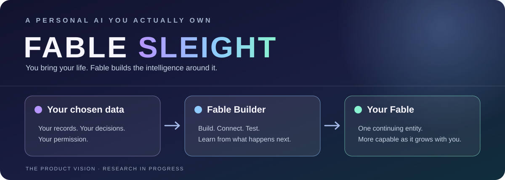

  

  <a href="#why-you-need-a-personal-ai">Why you need it</a> ·
  <a href="#the-idea-behind-fable">The idea</a> ·
  <a href="#the-personal-foundation">The foundation</a> ·
  <a href="#the-roadmap">Roadmap</a> ·
  <a href="#who-else-is-working-on-this">Comparison</a>

---

You wanna build a personal frontier model. But you don't wanna go through years of research and manual labor. You just wanna download an `.exe` file like a software and let it build automatically. **Fable is for you.**

No, Fable is not a local open weight model that you download and personalize. Because Fable gives you a **personal model, not a personalized model**. It comes with infrastructure that can build models. **Fable itself is not a model.**

> [!NOTE]
> **Where we actually are — September 2026:** Fable is not a downloadable consumer app yet. A.L.I.C.E. has working research foundations in evidence, memory, conversation, information access, and cognitive state. The Fable Builder Model is an active research workstream. We have not demonstrated a complete automatic consumer build, an end-to-end learned judgment loop, or user-owned frontier feature models.

## Why you need a personal AI?

Everyone deserves their own AI. Right now, many of us have AI agents for different tasks. They can be useful, but most start with a general model and see only the part of our life we put into that task. We as humans are different. We think differently. We should not have to be treated like the same person with a different set of files.

Even local models you can download and personalize usually come pretrained with someone else's weights. You can give them your files and teach them your preferences, but you are still working on top of a model built for everyone. The model grows with its manufacturing company, not with you.

### One life. Too many versions.

Your teacher sees the student. Your mother sees her child. Your friends see who you are with them. Your coding agent sees the project. Each knows a real version of you. None sees the whole picture.

## The idea behind Fable

The advice starts to conflict. Your teacher tells you to protect your research. Your family wants you to take the safe job. One AI agent fills your calendar while another tells you to rewrite the project. You're the only one who knows why each thing matters. But now you're out of ideas too.

You wish there were someone who already knew your whole life context. The first thought is a clone of you. It would know every choice you made and why you made it. No years of backstory every time you ask for help. But a clone would have your blind spots too. If you can't see a way forward, it might be just as stuck. If you're avoiding a hard decision, it might help you justify it.

So the wish changes. You want the **perfect version of you**: someone who knows your life, remembers what you forget, sees what you miss, and can solve the problems you can't. Someone who can challenge you because it understands you. **That's where Fable comes in.** It takes its starting character from you, develops its own judgment, and grows with you.

You cannot ask everyone to build their personal AI from scratch. Most people do not know how to train a model. Even if they do, choosing the architecture, preparing data, checking whether it learned the right thing, and keeping it updated takes years of research and manual labor.

So why don't we automate that process? Give Fable access to the raw data you choose. Let the builder create the personal pieces, link them into one entity, and keep improving them as it learns more about you. You should not need to code to get started.

The experience we want is simple. Download the software. Pick the folders and accounts you want it to learn from. Review what you are granting access to. Then let the builder do the work.

Behind that simple setup is the hard part:

1. **Understand the raw material.** Fable's builder reads authorized data, tracks where each piece came from, and separates things that happened from things it has inferred. When it does not know, it should say so. Synthetic examples can help train or test behavior; they cannot become fake memories.
2. **Build your personal foundation.** It forms the components that remember, understand you, develop a character, and learn from experience. The builder then connects them to one entity rather than handing you several disconnected bots.
3. **Give it useful abilities.** In the first release, Fable will use GPT and Claude APIs for feature tasks such as coding, research, simulation, vision, and image editing. Your personal foundation is the part we build and ship with Fable. The feature engines are services Fable can call.
4. **Let it grow with you.** When you correct Fable or a decision has a real outcome, the system should learn from it. A proposed update must be tested, versioned, and reversible. If it needs a new specialist, the builder should eventually be able to create one.

The amount of data does not determine whether you are allowed to begin. With little data, your Fable would begin with more unknowns and ask or learn over time. It cannot honestly claim to know a person from a nearly empty folder. And the `.exe` is a product goal: a consumer laptop cannot simply pretrain a GPT-scale model from someone's files.

### The personal foundation

The five names below are **the first personal capabilities FBM is meant to form and connect**. They are not a count of every model or system a Fable needs. A.L.I.C.E.'s [identity and memory architecture](https://github.com/NIne-WIngEd/A.L.I.C.E/blob/main/docs/MEMORY_IDENTITY_FORMATION_AND_HOST_LEARNING_ARCHITECTURE.md) distinguishes these roles. Its [MFM research plan](https://github.com/NIne-WIngEd/A.L.I.C.E/blob/research/mfm-foundation-20260923/docs/MEMORY_FORMATION_MODEL_FOUNDATION.md) says the builder should construct their Fable equivalents from your authorized data and suitable synthetic training examples. They may use different weights, representations, and stores.

| Starting capability | What it does |
| --- | --- |
| **Personality / identity model** | Forms a starting character and way of judging from supported evidence. Synthetic examples teach behavior without becoming fake memories. |
| **Memory Formation Model (MFM)** | Interprets new experiences and proposes memories, corrections, or unresolved questions. It does not decide what is true by itself. |
| **User / host model** | Learns your goals, habits, preferences, and changes over time. |
| **Relationship model** | Develops the shared history and ways of working between you and your Fable. |
| **Fable self / continuity model** | Keeps your Fable's own decisions, lessons, and development separate from your life history. |

That is only the beginning of the **non-feature foundation**. The [consumer product vision](https://github.com/NIne-WIngEd/A.L.I.C.E/blob/main/docs/FRIDAY_PRODUCT_VISION.md) and [capability catalog](https://github.com/NIne-WIngEd/A.L.I.C.E/blob/main/docs/CAPABILITY_CATALOG.md) also call for:

| Area | Further capabilities under research or planned |
| --- | --- |
| **Memory and context** | Episode formation, retrieval planning, context fusion, temporal and conflict interpretation, importance and consolidation. |
| **Personal understanding** | Preference and choice prediction, goals and missions, social, causal and world models, source trust, uncertainty. |
| **Judgment and growth** | Native personal judgment, reflection on outcomes, skill learning, preference rankers, and personal adapters. |

The **Experience Ledger**, evidence store, Claim Fabric, Memory Gate, and retrieval indexes are also essential. They are records or infrastructure, not automatically separate trained models. FBM is the builder that should connect and develop this stack. At installation it can only form what your data supports. Relationship history and Fable's lived experience must grow through real interaction.

There is **no fixed total model count** yet. Some later capabilities may become specialist learned models. Others may work better as structured state, tools, or shared model components. Coding, simulation, vision, and image editing are feature capabilities on top of this personal foundation.

## What will the first version include?

**Our first release goal:** ship the builder and the full personal foundation with the desktop software. That includes memory formation, the Experience Ledger, evidence and memory architecture, user and self development, relationships, and a judgment loop that can learn from real outcomes. We want these capabilities to work at the scale the product needs. A small memory demo with disconnected models would not be the Fable we are describing.

For feature work such as coding, simulation, research, vision, and image editing, the first version will call **GPT and Claude through their APIs**. Those calls use external services. Fable should show what information a feature request sends out and give the user control over it. The personal data store, builder, and personal learning stack are intended to run locally; an API request is not local merely because Fable initiated it.

This is the **release target, not the current state**. A.L.I.C.E. is our development case. FBM, MFM, and the complete experience-to-judgment learning loop still need to be built and validated before we can claim a consumer release with full capability and scale.

Later, we want to build our own frontier feature models. After that, we want FBM to build and improve feature specialists too. Automatic frontier-model training on consumer hardware remains a research goal. We will measure the compute, cost, and data requirements rather than promise that a laptop can train a GPT-scale model from personal files.

## What does it mean to own your Fable?

You should be able to see what it learned and where a belief came from. You should be able to correct it, revoke a source, delete data and its downstream influence, roll back a bad update, and take your personal state with you. If a general reasoning provider changes, your entire relationship with your Fable should not reset.

We intend to build and keep that personal state locally by default, with separate keys and storage for each person. The software will still need to earn a privacy claim through permissions, encryption, verified deletion, and honest handling of optional cloud services. Those protections have not been certified in a released Fable app.

Owning your personal intelligence does not mean claiming that you own OpenAI's or another provider's base weights because an API answered a question. We need to be exact about what is yours: your evidence, records, learned personal components, and future models that are actually built for you.

## The roadmap

Here is the order we are working toward. The later stages depend on proving the earlier ones; these are milestones rather than promised launch dates.

| Stage | What we are doing | What would show it works |
| --- | --- | --- |
| **Research now** | Build A.L.I.C.E.'s transferable cognitive foundations. Capture the construction process in FBM. Test N0's semantic and relational foundations. | Exact-version tests and experiments, including the failures. |
| **Prove the personal foundation** | Build and connect memory formation, the Experience Ledger, host and self models, relationships, goals, judgment, and real outcomes. Test them at the intended operating scale. | The complete loop works for distinct users. Relevant learned changes affect decisions; irrelevant changes do not. |
| **First consumer release** | Ship the builder and full personal stack in a desktop installer. Use GPT and Claude APIs for feature work. | Users can create and inspect their own Fable. Isolation, corrections, export, deletion, restore, rollback, and disclosed feature calls work. |
| **Our own feature models** | Build and evaluate frontier feature models for tasks now handled by APIs. | Better results on real tasks with measured cost and clear model ownership. |
| **Broader model factory** | Let the infrastructure construct and update more specialist models for each person. | Useful gains survive testing, model replacement, hardware limits, and rollback. |

A.L.I.C.E. is the research system where transferable capabilities are developed and tested first. Fable is the consumer product that must make them work for someone else, without carrying over A.L.I.C.E.'s private identity. Some upstream records still use the old internal name Friday.

We are in the first stage. We will test builds before release, but the first released version is meant to carry the full personal foundation at usable scale. Building our own frontier feature models and automating their construction are later research goals. We do not have a defensible release date yet.

## Who else is working on this?

Personal AI already exists in several forms. [Replika](https://replika.com/) offers an AI companion. [Personal AI](https://www.personal.ai/your-true-personal-ai) describes a memory stack and a personal language model trained on it. [Ollama](https://ollama.com/) helps people run models locally. We take those products seriously. We cannot say that nobody else gives people AI memory, companionship, local models, or even personally trained models.

Our bet is on making the **builder** a consumer product. Give it authorized raw material. Let it form and test several personal components. Keep them connected as one entity. Let that entity learn from your life, while the models that supply general skills can be replaced. Eventually, let the builder create more of those skills too. The combination is the hypothesis we have to prove with real users and working systems.

## The question behind Fable

Can building your own AI become as simple as installing software? And when it grows with you, can it actually be yours?

That is why we are building Fable Sleight. It is also where our YC application starts.

This repository begins with the product thesis. Code and product evidence will be added as capabilities qualify for consumer transfer.
