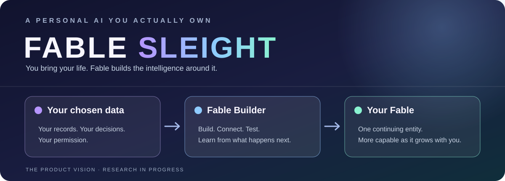
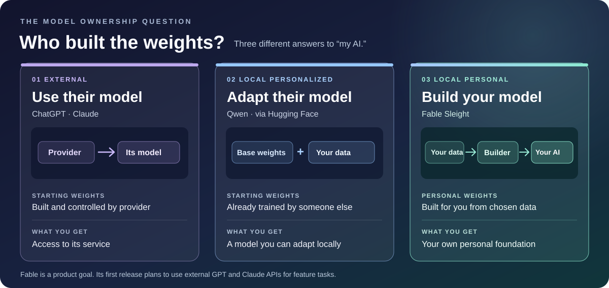

  

  <a href="#main-hypothesis">Main hypothesis</a> ·
  <a href="#why-you-need-a-personal-ai">Why you need it</a> ·
  <a href="#the-idea-behind-fable">The idea</a> ·
  <a href="#what-will-the-first-version-include">First release</a> ·
  <a href="#the-roadmap">Roadmap</a> ·
  <a href="#the-personal-foundation">The foundation</a> ·
  <a href="#who-else-is-working-on-this">Comparison</a>

---

## I'm gonna give you the infrastructure to build a personal model you can call yours.

Let's say you use ChatGPT or Claude. OpenAI or Anthropic built the model. You just use it. But you don't want your whole life inside someone else's AI. You don't wanna feed it all your data.

So for a while you turn to local open-weight models. You can personalize them, keep your data on your machine, and they feel more like yours. But you're still not really satisfied. Cause the open weights you got, You don’t own those open weights. You can’t claim those weights or that model as yours.

Then you realize all you want is the infrastructure that builds you a model from scratch. So it runs locally, and the personal weights you get you can truly call yours. You finally realize what a **personal model** means.

Fable itself is not the model. Fable is the builder.

**At Fable Sleight, I will give you exactly that. I will give you an automated infrastructure that makes you a personal model that is truly yours.**

But that's only half the story. Owning the model is the start. What it remembers, how it judges, and how it grows with you is the other half.

  

---

## Main Hypothesis

In the first paragraph, the justification behind Fable_Sleight sounds more like something out of a security concern, which is true, but not enough. So, here, we are leaving that out because that is not our main hypothesis. Our hypothesis here has 2 parts:

1. **In layman's terms:** every model consists of 2 things: **memory and features**. A feature is what the model does for you: different tasks like coding, simulation, etc.

   Memory is the part where the model tries to understand what feature the user really needs. And that's where the problem is. If you give a generic model to every user on the planet that is trained on common data and is equal for everyone, it is hard to assess that it will separately understand the different users using it unless the users train the model with their personal data.

2. **My 2nd argument is:** even if the user neglects the security part (which most people do) and trains the model with their personal data, how do we determine how much personal data is enough?

   Our answer is: no amount of personal data is enough since you are training an already instruction-tuned model with your data. So, the model may know you, but it will not behave for you.

> [!IMPORTANT]
> Our stronger hypothesis is that a separately learned personal foundation could outperform direct personalization of a general model **when personal data is limited, circumstances change, and consistent judgment matters more than imitation of someone’s writing.**

---

## The idea behind Fable

### One life. Too many versions.

Your teacher sees the student. Your mother sees her child. Your friends see who you are with them. Your coding agent sees the project. Each knows a real version of you. None sees the whole picture.

The advice starts to conflict. Your teacher tells you to protect your research. Your family wants you to take the safe job. One AI agent fills your calendar while another tells you to rewrite the project. You're the only one who knows why each thing matters. But now you're out of ideas too.

You wish there were someone who already knew your whole life context. The first thought is a clone of you. It would know every choice you made and why you made it. No years of backstory every time you ask for help. But a clone would have your blind spots too. If you can't see a way forward, it might be just as stuck. If you're avoiding a hard decision, it might help you justify it.

So the wish changes. You want the **perfect version of you**: someone who knows your life, remembers what you forget, sees what you miss, and can solve the problems you can't. Someone who can challenge you because it understands you. **That's where Fable comes in.** It takes its starting character from you, develops its own judgment, and grows with you.

The other half is Fable's personal foundation. It is meant to:

- **Remember what happened.** The Experience Ledger keeps a history of experiences, Fable's decisions, and their outcomes.
- **Know where a belief came from.** Fable tracks its sources. It keeps facts, guesses, and corrections distinct.
- **Understand both of you.** It learns about you, its own developing self, and the relationship between you without confusing one for another.
- **Bring the right context to a decision.** It draws on relevant memories, goals, and changes when you need help.
- **Learn from what follows.** Outcomes should change its future judgment when warranted, including when it should disagree with you.

> **See the idea as a story:** [Read *The Second Mind*, the interactive A.L.I.C.E. comic](https://raw.githack.com/NIne-WIngEd/Fable_Sleight/main/comic/index.html). It shows the destination we are building toward, not a finished product. [Read the complete 64-page storyboard](comic/STORYBOARD.md).

> [!NOTE]
> **Where we actually are — September 2026:** Fable is not a downloadable consumer app yet. A.L.I.C.E. has working research foundations in evidence, memory, conversation, information access, and cognitive state. The Fable Builder Model is an active research workstream. We have not demonstrated a complete automatic consumer build, an end-to-end learned judgment loop, or user-owned frontier feature models.
> [Read the build diary and roadmap](#the-roadmap).

## Why you need a personal AI?

Everyone deserves their own AI. Right now, we have AI agents for different tasks, but not an AI companion that knows us. We keep asking the same general models to reason about different people's lives. But we as humans are different. We reason differently. We want different things. So why should we all be treated by the same standard?

Even local models you can download and personalize usually come pretrained with someone else's weights. You can give them your files and teach them your preferences, but you are still working on top of a model built for everyone. The model grows with its manufacturing company, not with you.

## Why Fable matters

You cannot ask everyone to build their personal AI from scratch. Most people do not know how to train a model. Even if they do, choosing the architecture, preparing data, checking whether it learned the right thing, and keeping it updated takes years of research and manual labor.

So why don't we automate that process? Give Fable access to the raw data you choose. Let the builder create the personal pieces, link them into one entity, and keep improving them as it learns more about you. You should not need to code to get started.

The experience we want is simple. Download the software. Pick the folders and accounts you want it to learn from. Review what you are granting access to. Then let the builder do the work.

Behind that simple setup is the hard part:

1. **Understand the raw material.** Fable reads the data you choose and remembers where it came from. It keeps real events, guesses, and synthetic training examples separate.
2. **Build your personal foundation.** The builder creates the parts that remember, understand you, and make judgments. Then it joins them into one Fable.
3. **Give it useful abilities.** GPT and Claude handle things like coding, research, simulation, and vision in v1. Fable's personal foundation decides how to use those skills.
4. **Let it grow with you.** Your corrections and the outcomes of Fable's choices should change what it learns. Bad updates must be reversible.

You don't need a huge archive to begin. With less data, Fable knows less at first and learns over time. The easy `.exe` download is the goal; a laptop cannot train a GPT-scale model from a few personal files.

## What will the first version include?

**Our first release goal:** ship the builder and the full personal foundation with the desktop software. The [first-release design](docs/FIRST_RELEASE.md) records the conversation boundary, source selection, privacy controls, and qualification gates. That includes memory formation, the Experience Ledger, evidence and memory architecture, user and self development, relationships, and a judgment loop that can learn from real outcomes. We want these capabilities to work at the scale the product needs. A small memory demo with disconnected models would not be the Fable we are describing.

“Full personal foundation” is an architectural commitment, not shorthand for a smaller desktop edition. Fable v1 keeps the complete transferable cognitive/memory system even when one installation places it across a workstation, multiple local devices, a NAS, or owner-authorized private compute. The installer may adapt placement and execution to hardware. It does not delete graph, episodic, vector/multimodal, source-native, procedural, self/relationship, mission, working-memory, or deletion/unlearning capability because a simpler stack would be easier to package. The [full v1 execution profile](docs/FABLE_V1_EXECUTION_PROFILE_2026-09-27.md) records that boundary.

> [!NOTE]
> The first release will use external frontier model APIs **for feature work** such as coding, simulation, etc. Making those NLP and specialist models takes a lot of time and resources that we do not possess as a startup. And also, the main selling point of Fable is its memory architecture and the autonomous building capability. We are not making a product claiming it can code better or solve Millennium Problems.
>
> Also, Fable is designed in such a way that, even for that feature work, it won't directly send user queries through an API and show the output. That would disrupt the whole personal model claim of Fable. Instead, Fable will use API calls to gain probabilistic words by sending encrypted API signals, then craft a response on its own.
>
> Rest assured, once Fable is well-versed and funded, the long-term ambition is obviously far greater than that. Soon, we will replace the API calls with our own feature models (e.g., a coding model, a simulation model, etc.). And further along the way, we want to make Fable powerful enough that it gains the autonomous capability to build those feature models from scratch too on a consumer's PC, just like the memory models in Fable version 1.

This is the **release target, not the current state**. A.L.I.C.E. is our development case. FBM, MFM, and the complete experience-to-judgment learning loop still need to be built and validated before we can claim a consumer release with full capability and scale.

Upstream F4–F11 milestones are internal qualification steps, not smaller product editions. The first consumer release uses one predicate: `full_personal_cognitive_foundation_after_f11`. Alpha/beta labels can still describe controlled test distribution, but they do not relax that capability boundary.

## The roadmap

### How we got here

- **I started with one personal AI.** In July, A.L.I.C.E. was a question: could an AI remember a life without confusing guesses with facts? I wrote rules for evidence and correction, then built the vault and memory foundations. The bounded memory release passed 532 tests on synthetic data. [Evidence](https://github.com/NIne-WIngEd/A.L.I.C.E/commit/514edd98) · [Memory report](https://github.com/NIne-WIngEd/A.L.I.C.E/blob/main/docs/PHASE_2_FINAL_RELEASE_REPORT.md)
- **Then I learned that remembering is not growing.** Conversation and public research started working, but a good answer could still come from a replaceable language model. I added the Experience Ledger and Mission Graph so choices and outcomes have a history. Memory v4 began connecting that history to beliefs and goals. The loop that *learns* from an outcome is still unfinished. [Ledger](https://github.com/NIne-WIngEd/A.L.I.C.E/commit/e165b53f) · [Memory v4](https://github.com/NIne-WIngEd/A.L.I.C.E/commit/15e2713a)
- **That exposed the real product.** A.L.I.C.E. was built for one person. Copying her would give everyone someone else's AI. So I separated the consumer project, now Fable, and started the Fable Builder Model: the machinery that should construct a new personal foundation from each owner's chosen data. [Separation](https://github.com/NIne-WIngEd/A.L.I.C.E/commit/6b3a2ade) · [Builder](https://github.com/NIne-WIngEd/A.L.I.C.E/blob/fable-builder-model/docs/fable-builder/README.md)
- **The first tests made the plan sharper.** An audit found bias in the builder's first 60 seed examples. A review found the personal learning loop missing. The N0 two-GPU test hit a memory limit before qualification. I recorded those results and split out Memory Formation research. None of them is a completed builder or trained personal mind. [Builder audit](https://github.com/NIne-WIngEd/A.L.I.C.E/blob/fable-builder-model/docs/fable-builder/FBM_EXISTING_DATA_AUDIT_2026-09-26.md) · [Learning audit](https://github.com/NIne-WIngEd/A.L.I.C.E/blob/main/docs/research/PERSONAL_DEVELOPMENT_AUDIT_2026-09-22.md) · [Compute test](https://github.com/NIne-WIngEd/A.L.I.C.E/blob/alice-context/docs/chat-context/2026-09-28/N0_MEASURED_JOINT_P43_576237_FAILURE.md)

**Eleven weeks in:** the research foundations are real. Fable has no released app, customers, or revenue. The automatic build and learned judgment loop are still the tests that matter.

### What we must prove next

- **Qualify the personal foundation.** Finish native model, memory, and outcome-to-judgment tests. Show that its verdict controls both a decision and the words a language service proposes.
- **Run the evidence test.** Once A.L.I.C.E.'s five personal roles and memory fabric work together, simulate years of Rayan's changing life. On unseen decisions, compare its later judgments with the same language model given the same history through basic memory and retrieval. Check whether outcomes and corrections improve relevant decisions without changing unrelated ones. This would test the integrated mechanism before Fable ships; it would not yet prove the builder can reproduce it for other people. [Stage G plan](https://github.com/NIne-WIngEd/A.L.I.C.E/blob/main/docs/MEMORY_IDENTITY_FORMATION_AND_HOST_LEARNING_ARCHITECTURE.md#11-stage-g-testing-program)
- **Make the builder transferable.** With capital, fund engineering time, measured compute, privacy work, and independent tests with consenting people. Build from distinct owners' data and test whether correction changes later judgment. Measure quality, speed, cost, and data leaving the device. Talk to prospective users while we build.
- **Ship the first Fable.** Release only when that complete personal system and builder work together. General feature skills (coding, simulation, editing, etc) may use external APIs for the first release; the owner's memory and judgment stay local. [First-release gate](docs/FIRST_RELEASE.md)
- **Go beyond the first release.** Make builds reliable and affordable for more people. Measure whether Fable improves decisions over time. Then replace external feature services with our own models where they meet the bar. The five-year direction is a builder that can create more kinds of specialist models for each owner.

## The personal foundation

The five names below are **the first personal capabilities FBM is meant to form and connect**. They are not a count of every model or system a Fable needs. A.L.I.C.E.'s [identity and memory architecture](https://github.com/NIne-WIngEd/A.L.I.C.E/blob/main/docs/MEMORY_IDENTITY_FORMATION_AND_HOST_LEARNING_ARCHITECTURE.md) distinguishes these roles. Its [MFM research plan](https://github.com/NIne-WIngEd/A.L.I.C.E/blob/research/mfm-foundation-20260923/docs/MEMORY_FORMATION_MODEL_FOUNDATION.md) says the builder should construct their Fable equivalents from your authorized data and suitable synthetic training examples. They may use different weights, representations, and stores.

| Starting capability | What it does |
| --- | --- |
| **Personality / identity model** | Forms a starting character and way of judging from supported evidence. Synthetic examples teach behavior without becoming fake memories. |
| **Memory Formation Model (MFM)** | Interprets new experiences and proposes memories, corrections, or unresolved questions. It does not decide what is true by itself. |
| **User / host model** | Learns your goals, habits, preferences, and changes over time. |
| **Relationship model** | Develops the shared history and ways of working between you and your Fable. |
| **Fable self / continuity model** | Keeps your Fable's own decisions, lessons, and development separate from your life history. |

That is only the beginning of the **non-feature foundation**. The [consumer product vision](https://github.com/NIne-WIngEd/A.L.I.C.E/blob/main/docs/FRIDAY_PRODUCT_VISION.md) and [capability catalog](https://github.com/NIne-WIngEd/A.L.I.C.E/blob/main/docs/CAPABILITY_CATALOG.md) also call for:

| Area | Further capabilities under research or planned |
| --- | --- |
| **Memory and context** | Episode formation, retrieval planning, context fusion, temporal and conflict interpretation, importance and consolidation. |
| **Personal understanding** | Preference and choice prediction, goals and missions, social, causal and world models, source trust, uncertainty. |
| **Judgment and growth** | Native personal judgment, reflection on outcomes, skill learning, preference rankers, and personal adapters. |

The **Experience Ledger**, evidence store, Claim Fabric, Memory Gate, and retrieval indexes are also essential. They are records or infrastructure, not automatically separate trained models. FBM is the builder that should connect and develop this stack. At installation it can only form what your data supports. Relationship history and Fable's lived experience must grow through real interaction.

There is **no fixed total model count** yet. Some later capabilities may become specialist learned models. Others may work better as structured state, tools, or shared model components. Coding, simulation, vision, and image editing are feature capabilities on top of this personal foundation. There is likewise no fixed parameter, graph, context, data, memory, device, or deployment-topology ceiling for the personal foundation.

## What does it mean to own your Fable?

You should be able to see what it learned and where a belief came from. You should be able to correct it, revoke a source, delete data and its downstream influence, roll back a bad update, and take your personal state with you. If a general reasoning provider changes, your entire relationship with your Fable should not reset.

We intend to build and keep that personal state locally by default, with separate keys and storage for each person. The software will still need to earn a privacy claim through permissions, encryption, verified deletion, and honest handling of optional cloud services. Those protections have not been certified in a released Fable app.

Owning your personal intelligence does not mean claiming that you own OpenAI's or another provider's base weights because an API answered a question. We need to be exact about what is yours: your evidence, records, learned personal components, and future models that are actually built for you.

## Who else is working on this?

Personal AI already exists in several forms. [Replika](https://replika.com/) offers an AI companion. [Personal AI](https://www.personal.ai/your-true-personal-ai) describes a memory stack and a personal language model trained on it. [Ollama](https://ollama.com/) helps people run models locally. We take those products seriously. We cannot say that nobody else gives people AI memory, companionship, local models, or even personally trained models.

Our bet is on making the **builder** a consumer product. Give it authorized raw material. Let it form and test several personal components. Keep them connected as one entity. Let that entity learn from your life, while the models that supply general skills can be replaced. Eventually, let the builder create more of those skills too. The combination is the hypothesis we have to prove with real users and working systems.

## The question behind Fable

Can building your own AI become as simple as installing software? And when it grows with you, can it actually be yours?

That is why we are building Fable Sleight. It is also where our YC application starts.

This repository begins with the product thesis. Code and product evidence will be added as capabilities qualify for consumer transfer.
